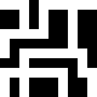

# Maze Solver

This is a ***very*** rudimentary maze solver.

It doesn't use any fancy algorithms, nor does it solve mazes fast - it's only purpose is to get to
the end of the maze *somehow*, *somewhen*.

# How to use

`python solve.py -h` or `--help` will show possible options.

The solver accepts an image of a maze as input.

### Input interpretation

Example input:

White pixels are interpreted as the path, and black pixels are interpreted as the walls.

By default, the start is the top left pixel, and the goal is the bottom right pixel, though this can be configured via command line options.

### Options

`-p <path>, --path <path>` specifies the path to the maze

`-b <x> <y>, --begin <x> <y>` specifies where the solver should start (defaults to "0 0")

`-e <x> <y>, --end <x> <y>` specifies where the solver should end (defaults to the bottom right pixel)

`-a, --animate` turns on animation mode, the solver will render images every few steps of the process (every single step by default)

`-s <steps>, --steps <steps>` specifies how often an animation frame will be rendered (defaults to 1)

`-o <path>, --output <path>` specifies the output file (or directory, if animating)